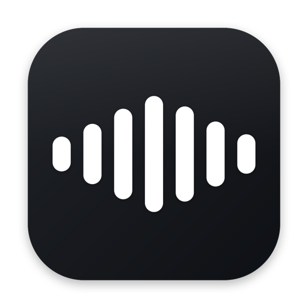

<div align="center">



# Orbit Flow

**Talk instead of type, in any app on your Mac.**<br>
Free, private dictation that runs entirely on your Mac. No account, no subscription, no cloud.

<a href="https://github.com/ian45623/OrbitFlow/releases/latest"></a>

[](https://github.com/ian45623/OrbitFlow/releases/latest)
[](https://github.com/ian45623/OrbitFlow/releases)


<sub>On the release page, download <b>Orbit.Flow.dmg</b> under <i>Assets</i>.</sub>

</div>

---

Hold a key, say what you want to write, let go. Clean, punctuated text appears wherever
your cursor is: Mail, Slack, Notes, your code editor, a browser form. The whole thing runs
on your Mac. Your voice is never uploaded, and once the speech model has downloaded it
works with Wi-Fi off.

## Features

- **Works in every app.** If you can type in it, you can dictate into it.
- **Private by design.** Speech is turned into text on your Mac by Apple's built-in speech
  engine, or by NVIDIA's Parakeet model on the Neural Engine. Audio never leaves the Mac.
- **Hold to talk, or tap to go hands-free.** Hold the key for a quick sentence. Tap it once
  to keep listening, tap again to stop. You choose the key, and you can set more than one.
- **Clean text, not a raw transcript.** Punctuation and capitals go in, filler words like
  "um" and "uh" come out, and saying "new line" or "new paragraph" does what you'd expect.
- **Your words, spelled right.** Add names, product terms and jargon to the Dictionary, or
  fix a word it keeps getting wrong (`cloud code -> Claude Code`). The Dictionary is a plain
  text file you can edit by hand.
- **History.** Every dictation is saved, so nothing you said is lost if the paste lands in
  the wrong place. Open any entry to copy it, rewrite it or hear it read back.
- **Read aloud.** Highlight text in any app and a small pill offers to read it to you. You
  can have it read as written, or ask for a summary, the gist, bullet points or a simpler
  explanation first. Off by default.
- **Optional AI rewrite.** Turn a rambling voice note into a clear message: Faithful,
  Casual, Professional or Problem-solver. Use Apple Intelligence on your Mac, or bring your
  own key for Anthropic, OpenAI, OpenRouter, Gemini or DeepSeek. Off by default.
- **Stays out of your way.** A small pill at the bottom of the screen shows it's listening,
  and it never steals focus from the app you're typing in.
- **Updates itself.** Settings ▸ Updates can install new versions automatically.

## Install

1. **[Download the latest release](https://github.com/ian45623/OrbitFlow/releases/latest)**
   and grab **Orbit.Flow.dmg** from the *Assets* list.
2. Open the disk image and drag **Orbit Flow** onto **Applications**.
3. Open Orbit Flow from Applications. macOS asks once whether you want to open an app you
   downloaded. Click **Open**.
4. Allow **Accessibility** (so it can see your shortcut key and type for you) and
   **Microphone** when asked.
5. Hold **Right ⌥ (Option)** and start talking.

Needs macOS 26 or later on an Apple silicon Mac (M1 or newer).

## Privacy

Out of the box, nothing leaves your Mac. There's no account, no analytics and no server.

| | |
|---|---|
| **Your audio** | Never sent anywhere, under any setting. |
| **Your text** | Stays on the Mac, unless you turn on AI rewrite or a read-aloud mode with a cloud provider. Then only the text is sent, to the provider you picked, using your own key. |
| **Your API keys** | Kept in the macOS Keychain. Not synced to iCloud. |
| **Your history** | Stored locally in your user folder. |

## AI rewrite

AI rewrite lives in **Settings ▸ Cleanup** and has three settings:

| | |
|---|---|
| **Off** | No AI anywhere. The default. |
| **On demand** | Dictation pastes as usual. You ask for a rewrite when you want one. |
| **Always** | Every dictation is rewritten before it pastes. |

With **On demand**, select text in any app, right-click, and open **Services**:

- **Rewrite with Orbit Flow** rewrites the selection in place using your current mode.
- **Orbit Flow ▸ Faithful / Casual / Professional / Problem-solver** does the same with the
  mode you pick right then.
- **Orbit Flow ▸ Open in Orbit Flow** opens the text in the app. There you can write your
  own instructions, switch between cloud and on-device, and compare versions side by side.

Give the one you use most a shortcut in **System Settings ▸ Keyboard ▸ Keyboard Shortcuts ▸
Services** and a rewrite is one keystroke away. You can also switch modes from the menu bar.

**Things worth knowing**

- If a rewrite fails during dictation, you still get your text with the basic cleanup. A
  network hiccup never costs you what you said.
- If a rewrite of selected text fails, your selection is left exactly as it was. The result
  is also copied to the clipboard, because some places (web pages, PDFs) can't be edited.
- **Faithful** checks that the answer contains only words you said. Dictate "what's the
  capital of France" and you get the question typed out, not "Paris". The other modes are
  meant to reword things, so they can't be checked the same way. If you dictate a lot of
  questions, stick with Faithful.

## Troubleshooting

**macOS says "Apple could not verify" the app.** You have a build from before releases were
notarized. Download the latest release and replace it. Or, to keep the one you have: System
Settings ▸ Privacy & Security ▸ **Open Anyway**.

**After updating, the shortcut key stopped working.** The first notarized build is signed
differently, so macOS may ask for Accessibility once more. Switch Orbit Flow on again under
System Settings ▸ Privacy & Security ▸ Accessibility.

**Holding the key does nothing.** Check that Orbit Flow is switched on under System
Settings ▸ Privacy & Security ▸ Accessibility, then quit and reopen the app.

**Accessibility shows as on, but it still doesn't work.** Reset just Orbit Flow's
permission, then allow it again:

```bash
tccutil reset Accessibility ai.pivotstudio.orbitflow
```

Always include `ai.pivotstudio.orbitflow`. Without it, the command resets the permission for
every app on your Mac.

**Another dictation app uses the same key.** Pick a different key in Orbit Flow's Settings.
Two apps on the same key will both record and both paste.

## Build from source

```bash
git clone https://github.com/ian45623/OrbitFlow.git
cd OrbitFlow
make install     # build, sign, copy to /Applications and launch
```

You need the Xcode Command Line Tools (`xcode-select --install`). See
[docs/development.md](docs/development.md) for architecture and build notes, and
[docs/distribution.md](docs/distribution.md) for packaging and releases.

## Contributing

Bug reports and ideas are welcome in
[Issues](https://github.com/ian45623/OrbitFlow/issues). Pull requests are welcome too. For
anything big, open an issue first so we can talk it through.

If Orbit Flow saves you some typing, a ⭐ helps other people find it.
